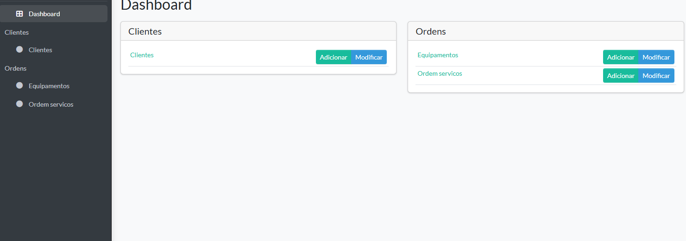
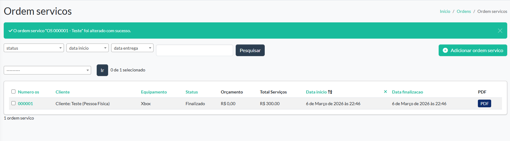
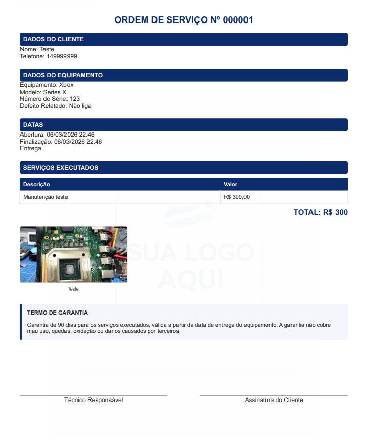

# 🎮 Sistema de Ordem de Serviço

Sistema web desenvolvido para gestão de ordens de serviço em uma assistência técnica de videogames, permitindo o controle de clientes, equipamentos, diagnósticos e status de manutenção.

Este projeto foi criado como projeto pessoal com uso real, aplicado em uma assistência técnica, e desenvolvido a partir dos conhecimentos adquiridos durante meus estudos na formação Django: crie aplicações em Python, da plataforma Alura.

# 🎯 Objetivo do Projeto

O sistema foi desenvolvido com o objetivo de digitalizar e organizar o fluxo de trabalho de uma assistência técnica, substituindo controles manuais por um sistema centralizado.

Com ele é possível:

👤 Registrar clientes

🎮 Cadastrar equipamentos

📋 Criar e acompanhar ordens de serviço

🔄 Controlar o status da manutenção

📄 Gerar relatórios e documentos em PDF

🗂 Centralizar todas as informações da assistência técnica

Além do uso prático, o projeto também foi desenvolvido com foco em aprendizado de desenvolvimento back-end e construção de portfólio profissional.

# 🧠 Base de Estudos

Este projeto foi desenvolvido com base nos conhecimentos adquiridos na formação:

📚 Django: crie aplicações em Python — Alura

Durante os estudos foram aplicados conceitos como:

Estrutura de projetos Django

Modelagem de banco de dados com ORM

Criação de views e templates

Utilização do Django Admin

Manipulação de formulários

Organização de aplicações web em Python

O projeto também foi expandido com funcionalidades adicionais além das apresentadas na formação, como geração de PDF e regras de negócio específicas para ordens de serviço.

# ⚙️ Principais Funcionalidades

👤 Cadastro de clientes

🛠️ Criação e gerenciamento de ordens de serviço

📊 Controle de status da OS

📄 Geração automática de PDF da ordem de serviço

🎨 Interface administrativa customizada

🧩 Layout personalizado no Django Admin

🔐 Uso de variáveis de ambiente para dados da empresa

🏢 Estrutura preparada para uso em ambiente real

# 💻 Tecnologias Utilizadas

🐍 Python 3.11

🌐 Django

🎨 Django Jazzmin

📄 WeasyPrint

🗄️ SQLite

🧱 HTML + CSS

🔐 Python Dotenv

🐙 Git 

🐙 GitHub

# 📷 Screenshots do Sistema
Dashboard / Visão geral



Lista de Ordens de Serviço



PDF da Ordem de Serviço



# 🗂️ Estrutura do Projeto

```text
sistema-ordem-servico/
│
├── clientes/                  # App responsável pelo cadastro de clientes
│
├── servicos/                  # Tipos de serviços realizados
│  
│
├── ordens/                    # Gerenciamento das ordens de serviço
│                               
│
├── core/                      # Configurações principais do projeto Django
│   ├── settings.py            # Configurações do projeto
│   ├── urls.py                # Rotas principais
│   └── wsgi.py                # Configuração de deploy
│
├── static/                    # Arquivos estáticos (CSS, imagens, logos)
│
├── manage.py                  # Script principal do Django
│
└── requirements.txt           # Dependências do projeto
``` 
Observação: arquivos enviados pelos usuários são armazenados na pasta `media/`, que não está incluída no repositório por estar listada no `.gitignore`.

# ▶️ Como Executar

1. Clone o repositório
```bash
git clone https://github.com/luanglad/sistema-ordem-servico.git
cd sistema-ordem-servico
```
2. Crie um ambiente virtual
```bash
python -m venv venv
```
3. Ative o ambiente virtual
- Windows:
```bash
venv\Scripts\activate
```
- Linux / Mac:
```bash
source venv/bin/activate
```
4. Instale as dependências
```bash
pip install -r requirements.txt
```
5. Execute as migrações
```bash
python manage.py migrate
```
6. Inicie o servidor
```bash
python manage.py runserver
```
7. Acesse o sistema
```bash
http://127.0.0.1:8000
```
# 🔒 Observações

Para preservar a privacidade do ambiente real onde o sistema foi utilizado:

Algumas imagens foram substituídas por placeholders

Arquivos sensíveis foram removidos

Variáveis de ambiente não estão incluídas no repositório

# 👨‍💻 Autor

Luan Glad

💻 Focado em Backend, Sistemas Web e Arquitetura de Software

---

# 📜 Licença

Este projeto foi desenvolvido como **projeto pessoal para fins de estudo, portfólio e uso real em uma assistência técnica**.

O código disponibilizado neste repositório **não é open source** e não está autorizado para uso comercial, redistribuição ou reprodução sem permissão prévia do autor.

Caso tenha interesse em utilizar partes do projeto ou aprender mais sobre sua implementação, entre em contato com o autor.

© 2026 Luan Glad. Todos os direitos reservados.